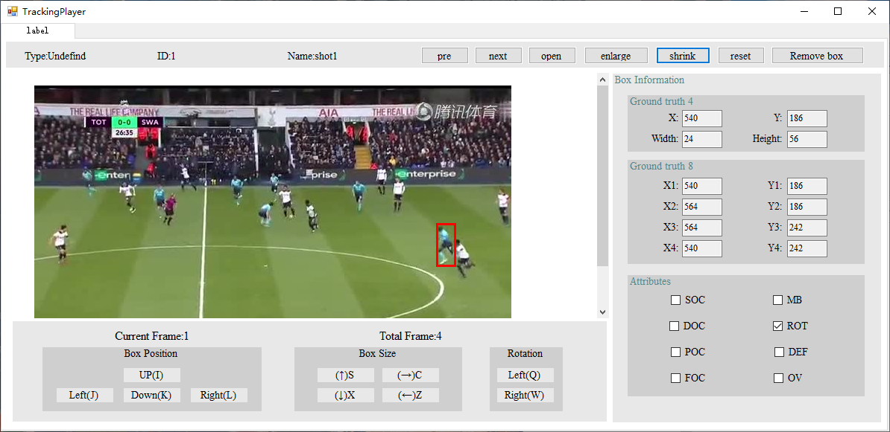

# 足球比赛图片标注工具

这是一个足球比赛相关图片的一种标注工具，用于对比赛中的球员进行标框，并标记该球员的一些状态。这个标注工具其实是第二个版本，第一个版本在[这里](https://github.com/834810071/footballer-label-tool)，由于需求变化，在此基础上修改了一些功能。

## 功能：

- 用鼠标对球员进行标框处理
- 能够快速切换图片以及对标框进行微调，具体的快捷操作包括
	1. 上/下/左/右 移动，快捷键是8/5/4/6（小键盘）或I/K/J/L
	2. 高度/宽度调整，快捷键是S/X/Z/C
	3. 标框旋转变换，快捷键是Q/W
	4. 图片是快速切换，快捷键是上/下/左/右
- 能够记录图片标框的标注情况，坐标文件保存在groundtruth8文件夹中
- 能够标记球员的一些状态，包括遮挡与消失等，标记文件保存在label文件夹中
- 记录每张图片球员消失的情况，用向量（0/1，0/1）表示，第一个量表示球员是否是由于遮挡消失，第二个量表示球员是否是跑出画面而消失，标记文件保存在absent文件夹中
- 记录整个图片数据集状态情况，由一个8个元素向量表示，存放在attribute文件夹中。
- 所有文件自动实时保存，无需手动保存

## 使用方式

推荐运行环境vs

目录结构为：

```
  ├── anno
  │   ├── absent
  │   ├── attribute
  │   ├── groundtruth8
  │   └── label
  ├── sequences
  │   ├── shot1
  │   └── shot2
```

图片数据保存在sequences下的文件夹中，程序会根据存放文件的文件夹的名字命名label等文件。

使用过程如下所示：

- 点击open按钮可以选择存放图片的文件夹，但是注意该文件夹必须在sequences文件夹下面

- 左边会显示每张图片的路径，右边是可选择的标记以及标框的坐标值。

- 点击左边的路径会将图片加载在中间，利用鼠标进行标框

- 上面有放大/缩小/重置按钮可以对图片缩放处理，去框按钮可以去除标框

- 可以使用上面提示的快捷键进行微调




